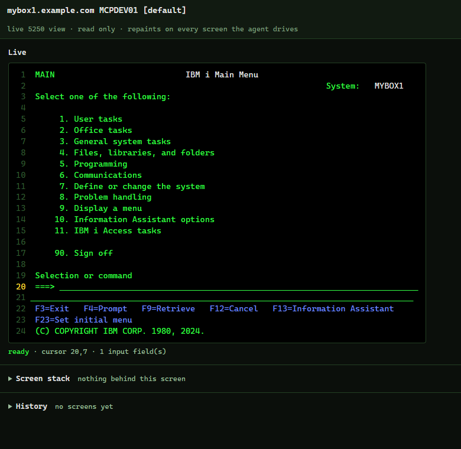
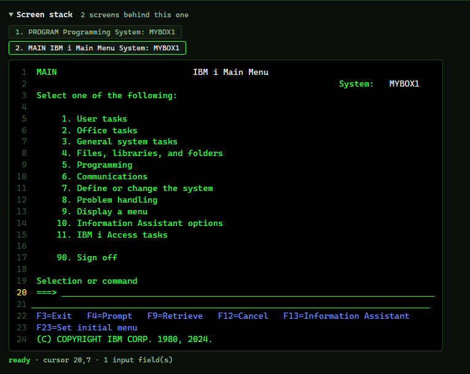
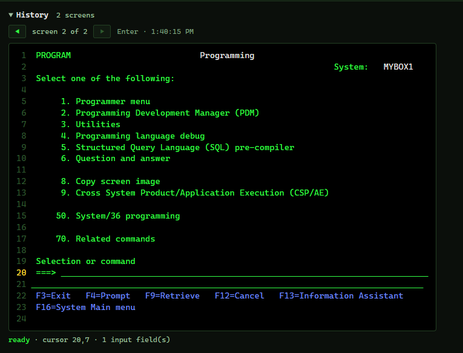

# ibm-i-5250-mcp

[](LICENSE)
[](package.json)
[](package.json)
[](https://github.com/modelcontextprotocol/typescript-sdk)
[](https://www.ibm.com/docs/en/i)

An [MCP](https://modelcontextprotocol.io) server that lets AI tools like Claude Code drive IBM i 5250
green screens, the way the Playwright MCP server drives web pages. An agent opens a session, sees the
screen in a structured form, types into fields, presses keys, and reads the result back.

Interactive RPG is the code nobody can test automatically: it only exists when a display file is on
a screen and someone is typing into it. The source says what should happen and nothing says what did. This server hands an assistant the screen itself, so a program can be driven, watched
and pinned down with tests that run again after every compile.

It speaks TN5250 straight over a socket, negotiating BINARY, TERMINAL-TYPE, END-OF-RECORD and
NEW-ENVIRON the way a real terminal does. No emulator, no JVM, no SSH tunnel, nothing to install on
the IBM i, and pure Node on the client. If the telnet server is started, which it is by default, this
works.

## Example workflow

Say you ask: "open order entry on PROD, put the cursor on the fifth line and delete it."

1. `session_open(server: "PROD")` signs on and returns the first screen.
2. `screen_do(actions: ["type f1: 1", "key: Enter"])` walks the menus. Typing and the key travel as
   one exchange, because a 5250 holds typing locally and transmits nothing until an AID key.
3. Every action returns a snapshot: the literal screen, plus the format table with stable refs.

   ```
   screen: signature 8156d875c512
   size: 24x80   cursor: 18,7   keyboard: unlocked

       ....5....1....5....2....5....3....5....4....5....5....5....6....5....7....5....8
    1 |                                 Command Entry                         MYBOX1   |
    2 |                                                           Request level:   1   |
   17 | Type command, press Enter.                                                     |
   18 | ===>                                                                           |
   22 | F3=Exit   F4=Prompt   F9=Retrieve   F10=Include detailed messages              |

   fields: 1 input, 0 output
     [f1] 18,7    len 313  INPUT  ""
   ```

   Blank rows are dropped and real row numbers kept. The snapshot also lists the stack: the screens
   behind this one, nearest first, which is usually where F3 and F12 lead back to. A window is named
   on a line of its own, and is a screen of its own on the stack unless the host paints it straight
   over the screen below, with no clear and no save.
4. `screen_do(actions: ["cursor: 6,2", "key: F2"])` opens the confirmation window the program paints.
   The snapshot now carries the window's field, and the cursor is inside it.
5. `screen_do(actions: ["type f23: Y", "key: Enter"])` answers it.
6. `run_tests` replays the whole thing from a Markdown file after the next compile, so the answer
   stays answered.

## The live view

Set `IBMI_5250_VIEWER=true` to turn it on. `session_open` then starts a small page on your machine
and returns its URL. Open it once and watch the green screen repaint as the agent works, in the real
5250 colours, with the cursor and keyboard state.



The page is non interactive, so it is there to watch and nothing more. It runs on
`http://127.0.0.1:5250`, or whatever port you set in `IBMI_5250_VIEWER_PORT`, and the URL carries a
token that is new for every session.

Under the live screen are two sections, both closed until you open them.

### Screen stack

The screens behind the one on display, nearest first, like a stack of cards. Going back to one of
them takes the cards above it off the stack. Click a screen to see it as it was when it was last on
top, and click it again to hide it. The agent gets the same stack as text in every snapshot.



### History

Every screen before the one on display, one for each key the agent pressed, labelled with the key
and the time. Step back and forward with the arrows, or with the left and right arrow keys. Stepping
back holds the view while new screens arrive, and newest jumps to the latest again. A page opened
in the middle of a session still gets the whole history, up to the last 500 screens.



## Requirements

- Node 18 or newer on the client.
- A telnet server running on the IBM i, which is the default. Port 23 plain, or 992 for TLS.
- A user profile to sign on with. Make a dedicated one rather than using your own, because a green
  screen has a command line. See Security for more info.

## Install

Run it straight from npm with npx (no build), or clone and build from source. Either way, all
settings live in a `.env` file (see Configuration).

### Option A: from npm

Register the server with Claude Code:

```sh
claude mcp add ibmi-5250 --scope user -- npx -y ibm-i-5250-mcp
```

Or install it once and point at the binary:

```sh
npm install -g ibm-i-5250-mcp
claude mcp add ibmi-5250 --scope user -- ibm-i-5250-mcp
```

Then create a `.env` with your connection details in `~/.ibm-i-servers/` if the other IBM i MCP
servers should use it too, or in `~/.ibm-i-5250-mcp/` if only this one should (create the folder if
it does not exist). Restart Claude Code or run `/mcp`. A package installed from npm or run with `npx`
has no stable folder of its own (the npx copy lives in a cache that is wiped on every update), so a
home folder is the reliable place to keep credentials. See Configuration for the full search order.

### Option B: from source

```sh
git clone https://github.com/SH4RKKK/ibm-i-5250-mcp && cd ibm-i-5250-mcp
npm install && npm run build
cp .env.example .env
claude mcp add ibmi-5250 --scope user -- node "$PWD/dist/index.js"
```

Fill in the required values in your `.env` (the optional ones are under Configuration):

```
IBMI_HOST=your.ibmi.host
IBMI_USER=MYUSER
IBMI_PASSWORD=changeme
```

Restart Claude Code or run `/mcp` and the tools show up. Built from source, the server reads the
`.env` from its own folder, so it works no matter which directory Claude Code launches it from.

## Configuration

All configuration lives in a `.env` file. The server looks for it in these places, first match wins,
and the first file found supplies the whole profile rather than being merged with the others:

1. a folder you name yourself in `IBMI_MCP_CONFIG_DIR`. Set it on the MCP server entry rather than in
   your shell, because your MCP client launches the server, not you:
   `claude mcp add ibmi-5250 --env IBMI_MCP_CONFIG_DIR=/path/to/folder -- npx -y ibm-i-5250-mcp`
2. `~/.ibm-i-servers/`, shared with the other IBM i MCP servers
3. `~/.ibm-i-5250-mcp/`, for profiles only this server should see
4. the server's own install folder, next to `dist/`, if you cloned and built from source

A real environment variable, if one is set, always takes precedence over a value in the file.

Put a box in `~/.ibm-i-servers/` and every IBM i MCP server you run picks it up from there, so its
host, user and password are written once instead of once per server. Use `~/.ibm-i-5250-mcp/` only
for a box this server should reach and the others should not, and note that the shared folder wins
when the same name is in both.

| Variable | Required | Default | Purpose |
|---|---|---|---|
| `IBMI_HOST` | yes | | IBM i host or IP |
| `IBMI_USER` | yes | | user profile |
| `IBMI_PASSWORD` | yes | | password |
| `IBMI_5250_DEVICE` | no | | virtual device to claim. Set a fixed name, or the host picks a `QPADEVxxxx` and the job attributes change between runs |
| `IBMI_5250_PORT` | no | `23` | `992` is telnet over TLS, `23` is plain |
| `IBMI_5250_CCSID` | no | `37` | EBCDIC code page. 273 German, 500 international, 1140 US with the euro sign |
| `IBMI_5250_TERMINAL` | no | `IBM-3477-FC` | terminal type to negotiate. `IBM-3179-2` for a box that refuses it, at 24x80 |
| `IBMI_5250_TLS_INSECURE` | no | `false` | accept any certificate on 992, self signed included |
| `IBMI_5250_VIEWER` | no | `false` | `true` starts the live view |
| `IBMI_5250_VIEWER_PORT` | no | `5250` | falls back to a free port when this one is busy |
| `IBMI_5250_CURLIB` | no | | typed into Current library at sign on |
| `IBMI_5250_PROGRAM` | no | | typed into Program/procedure at sign on |
| `IBMI_5250_MENU` | no | | typed into Menu at sign on |
| `IBMI_RESTRICTED` | no | `true` | `false` lifts the allowlist on what may be typed on a command line |
| `IBMI_ALLOWED_CL` | no | | extra verbs allowed on a command line in restricted mode |
| `IBMI_BLOCKED_CL` | no | | extra verbs refused when restricted mode is off |

The screen size is not a setting. The host picks it per screen with Clear Unit or Clear Unit
Alternate, so one session renders a 24x80 program at 24x80 and a 132 column one at 132.

### Restricted mode

Restricted mode is an allowlist, and it is on unless you set `IBMI_RESTRICTED=false`. Ten job scoped
commands can be typed on a command line and everything else is refused: `call`, `strdbg`, `enddbg`,
`chgcurlib`, `addlible`, `rmvlible`, `chglibl`, `dsplibl`, `edtlibl` and `signoff`. Put your own
start command in `IBMI_ALLOWED_CL`.

Turn it off and nothing is refused unless `IBMI_BLOCKED_CL` names it. There is no built in denylist,
because all the guard ever sees is text going into a field. Guessing at destructive verbs by prefix
would read as protection without being any.

See `assertCommandAllowed` in [src/guard.ts](src/guard.ts).

### Multiple servers

To work with more than one IBM i, add one env file per box next to `.env`. The name after `.env.` is
the server name.

```
.env          the default server
.env.PROD     a server named PROD
.env.DEV      a server named DEV
```

Each file holds the same variables for that box. You never type the server name yourself:
`session_open` takes an optional `server` argument and the assistant fills it in from what you say,
so "open a session on PROD" loads `.env.PROD`. Say nothing about a box and it uses `.env`.
`list_servers` is how the assistant learns which names exist.

## Tools

### Session

- **`session_open`**: connects, signs on and returns the first screen. Clears
  the device level screens in the way, including the "Attempt to Recover Interactive Job" one a
  previous dropped session leaves behind. `device`, `library`, `program` and `menu` override the
  profile for this session.
- **`session_close`**: signs off and releases the device. It presses its way out of an application
  first, using F12 to decline a screen that is asking something and F3 otherwise, both of which
  discard rather than commit.
- **`list_servers`**: the configured boxes, the sessions currently open, and the folders that were
  searched.

### Drive the screen

- **`screen_do`**: takes a list of actions, runs them in order, and returns only the final screen.
  Three action forms, the same ones a test file uses:

  | Action | Does |
  |---|---|
  | `type f1: ACME LTD` | put text in a field, by ref, by `row,col`, or by DDS name once known |
  | `key: Enter` | Enter, F1 to F24, PageUp, PageDown, Help, Clear, Print |
  | `cursor: 6,53` | move the cursor before the key |

  Cursor position is an argument to the key, which is why it has its own action: Help on a message
  line explains that message, Help anywhere else explains the field under it. If an action fails the
  run stops there, and the error names the action and returns the screen as it stands.
- **`screen_snapshot`**: the current screen, changing nothing.

### Tests

- **`run_tests`**: replays the screen tests in `screen-tests/` and reports what passed. Opens its own
  session when none is given, and signs it off afterwards.

## Screen tests

Work in progress. The format below runs, but expect it to change.

A test is a Markdown file in `screen-tests/`. Prose is ignored, so the file reads as a specification,
and the runner only looks at two fenced blocks: `5250-do` for the same action lines `screen_do` takes,
and `5250-expect` for checks.

````
```5250-do
type f1: call mylib/ordentr
key: Enter
```

```5250-expect
text: Order Entry
message: none
fields: 4 input
```
````

Run them in conversation with `run_tests`, or from a terminal:

```sh
node scripts/test.mjs                              # screen-tests/ on the default box
node scripts/test.mjs screen-tests MYBOX           # a folder, or one .md file
node scripts/test.mjs screen-tests MYBOX ordentr   # only tests whose file name matches
```

From a terminal it exits non zero when anything failed, so a build job can gate on it.

A `5250-expect` block asserts what the screen should look like. `text` and `not text` look for a
substring, `message` for a message id or `none`, `fields` for the number of input fields, and
`field f1` for one field's exact value. `cursor`, `keyboard` and `signature` check where the cursor
sits, whether the keyboard is locked, and whether the layout still matches.
[screen-tests/example.md](screen-tests/example.md) explains each one in full.

## Progress and logging

Tools narrate while they run, so a slow box looks slow rather than hung.

Live updates go out as MCP [progress notifications](https://modelcontextprotocol.io/specification/2025-06-18/basic/utilities/progress)
when the client asks for them, which Claude Code does: `signing on as MYUSER`, `pressing F3 to reach
a screen with a command line`, `running test 2 of 7`. Clients that do not ask get the same messages
as info level log notifications instead. Everything is mirrored to stderr, because stdout is the
JSON-RPC channel and anything printed there would corrupt the protocol.

When nothing has happened for eight seconds a watchdog repeats the last step with the elapsed time
(`still working: pressing Enter (24s elapsed)`). A host that never answers times out after 15
seconds, and the error names the request it was last waiting on and returns the trail with timings.

## Security

This server signs on to your IBM i and types into whatever screen is in front of it. A green screen
has a command line, so anything driving it can type a CL command into a field and press Enter. Treat
it like any tool that can act on the box.

- **Least privilege first.** The server can do exactly what the profile in the env file can do, so
  give it one that reaches the program under test and nothing else. Add `lmtcpb(*yes)` and IBM i
  itself refuses almost everything typed on a command line. Restricted mode narrows it further.
- **Password masking.** Anything the screen hides while you type it stays hidden. Your password never
  shows up in what the assistant reads, in the live view, or in the logs.
- **The live view.** A non interactive page, served on 127.0.0.1 only, gated by a token that is new
  for every session.
- **Prompt injection.** Screen text, message lines and field values come back to the model as
  untrusted text. A program could paint text that tries to steer the assistant into typing something.
  The controls above limit what that could actually do.
- **Secrets.** Credentials live in `.env` and `.env.*`. Keep them readable only by you.

## Project layout

```
src/
  index.ts       tool registration
  session.ts     one 5250 session
  telnet.ts      TN5250 transport
  screen.ts      screen buffer and format table
  inbound.ts     records sent to the host
  codes.ts       5250 code tables
  guard.ts       the command line guard
  ebcdic.ts      EBCDIC tables
  snapshot.ts    the LLM facing view of a screen
  stack.ts       the screen stack
  render.ts      the live view page
  viewer.ts      the live view server
  config.ts      config discovery and the Profile loader
  testrun.ts     the screen test runner
  report.ts      progress and logging
  types.ts       shared types
  selfcheck.ts   npm run check, the test suite
scripts/
  smoke.mjs      live smoke test
  test.mjs       screen tests from a terminal
test/fixtures/
  signon.bin     a sign on record, for the test suite
docs/            the live view screenshots
```

## Acknowledgements

Written from scratch, building on the work of others:

- **[green-screen-react](https://github.com/visionbridge-solutions/green-screen-react)** (MIT): the
  5250 code tables were adapted from `packages/proxy/src/tn5250/constants.ts`.
- **[tn5250](https://github.com/tn5250/tn5250)** (LGPL-2.1): read as reference for the data stream
  and the save screen and query replies. No code was copied.

Thanks to those teams and the wider IBM i community.

## License

Apache-2.0. See [LICENSE](LICENSE) and [NOTICE](NOTICE). The 5250 code tables adapted from
green-screen-react keep their MIT license, which NOTICE carries in full. The dependencies keep their
own licenses (MIT and BSD-2-Clause), both of which are compatible with Apache-2.0.
